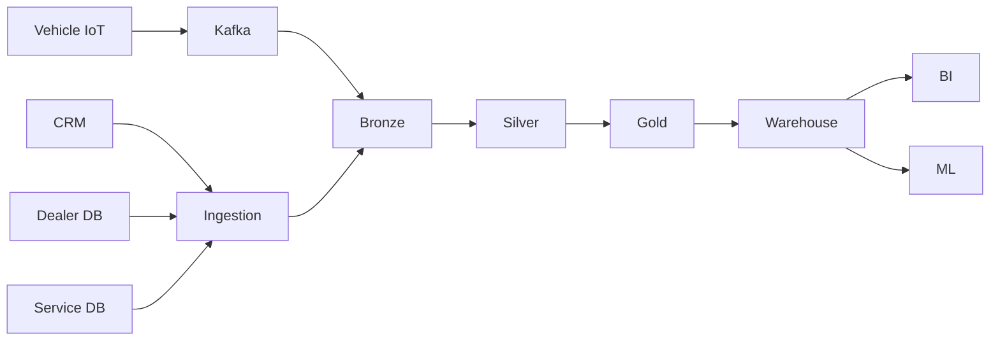

# Production Architecture Notes



## Responsibilities

### Ingestion

Capture source records reliably.

### Bronze

Preserve raw information.

### Silver

Clean and standardize.

### Gold

Create business-oriented models.

### Warehouse

Serve analytical workloads.

### BI

Expose metrics and dimensions.

## Failure Scenarios

```text
Kafka delay
Source outage
Duplicate event
Late event
Schema change
Bad dimension
Incorrect transformation
```

Every production model should define how these scenarios are handled.

## Monitoring

Monitor:

```text
Freshness
Row counts
Duplicate rate
Null rate
Pipeline duration
Source lag
Failed records
Schema changes
```
