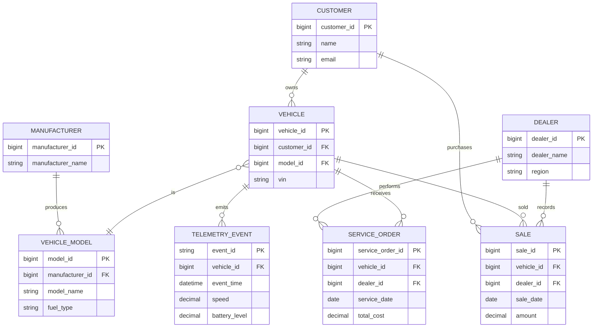

# Automobile ERD

## Modeling Observation

The ER model represents operational relationships.

The warehouse model should not simply copy this ERD. It should be redesigned
around analytical business processes and grains.
