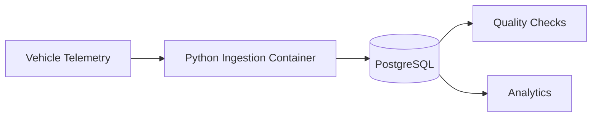

# Day 19 — Docker for Data Engineering 🐳

A complete Docker learning module focused on practical data engineering.

## Learning Objectives

- Understand containers, images, layers, registries, volumes and networks.
- Write Dockerfiles.
- Build, tag and run images.
- Manage container lifecycle.
- Use Docker Compose.
- Containerize Python ETL jobs.
- Run PostgreSQL with persistence.
- Connect services using Docker networking.
- Use environment variables and health checks.
- Debug failed containers.
- Optimize images and builds.
- Apply container security practices.
- Understand registries and CI/CD.
- Build a realistic automobile telemetry project.

## Core Mental Model

```text
Dockerfile
    |
    | docker build
    v
Image
    |
    | docker run
    v
Container
```

Supporting components:

```text
Container
  +-- Network → communication
  +-- Volume  → persistent data
  +-- Registry → image distribution
```

## Docker in Data Engineering

```text
                 Docker Compose
                      |
       +--------------+--------------+
       |              |              |
       v              v              v
    Python         PostgreSQL     Quality
      ETL             DB           Checks
       |              |              |
       +--------------+--------------+
                      |
                      v
                  Analytics
```

Docker is the packaging/runtime layer. It is not itself a database, ETL engine, warehouse or streaming engine.

## Automobile Example 🚗



Example event:

```json
{
  "vehicle_id": "VH1001",
  "event_time": "2026-09-03T10:15:00Z",
  "speed_kmh": 72,
  "battery_soc": 81.5,
  "engine_temp_c": 91.2
}
```

## Repository

```text
Day-19-Docker/
├── README.md
├── ROADMAP.md
├── GIT-COMMIT.md
├── docs/
├── examples/
├── compose/
├── dockerfiles/
├── automobile-project/
├── tests/
├── cheat-sheet/
└── resources/
```

## Essential Commands

```bash
docker --version
docker compose version
docker run --rm hello-world

docker images
docker pull python:3.12-slim
docker build -t app:1.0 .
docker run --rm app:1.0

docker ps
docker ps -a
docker logs <container>
docker exec -it <container> sh
docker inspect <container>
docker stop <container>
docker rm <container>

docker compose up
docker compose up --build
docker compose ps
docker compose logs
docker compose down
```

## Final Goal

Move from:

> "I know how to run Docker."

to:

> "I can design a reproducible containerized environment for a data engineering pipeline."
