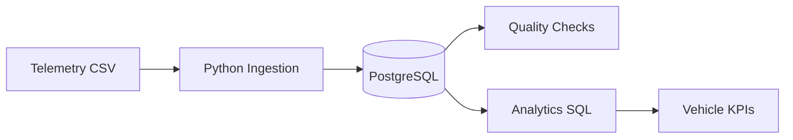

# Advanced Project — Containerized Automotive Telemetry 🚗🐳

## Business Scenario

A connected-vehicle company receives telemetry events from vehicles.

Each event contains:

- vehicle ID
- event timestamp
- speed
- battery SOC
- engine temperature
- GPS coordinates

## Learning Objective

Build a reproducible local pipeline:

```text
Telemetry CSV
     ↓
Python Ingestion Container
     ↓
PostgreSQL
     ↓
Quality Container
     ↓
Analytics
```

## Architecture



## Start

```bash
cd automobile-project
docker compose up --build
```

## Check

```bash
docker compose ps
docker compose logs etl
docker compose logs quality
```

## Query

```bash
docker compose exec postgres psql   -U data_engineer   -d automotive   -c "SELECT * FROM vehicle_telemetry ORDER BY event_time;"
```

## Analytics

Open:

```text
analytics.sql
```

It contains queries for:

- average speed
- average battery SOC
- high-speed events
- maximum engine temperature
- event count

## Reset

```bash
docker compose down -v
```

Then:

```bash
docker compose up --build
```

Use this reset only for the disposable learning database.

## Production Evolution

```text
Vehicles
 ↓
Telemetry Gateway
 ↓
Kafka
 ↓
Flink / Spark
 ↓
Object Storage
 ↓
Lakehouse
 ↓
Warehouse
 ↓
BI / ML
```

Docker can package application components, but production also needs security, governance, observability, reliability and scalable storage.
