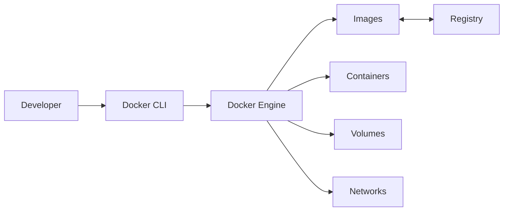

# 01 — Docker Fundamentals

## What Is Docker?

Docker provides tools for building, packaging, distributing and running applications as containers.

A container generally contains application code, runtime components and user-space dependencies while sharing the host kernel.

## Why Docker Exists

Without containers, a team may have:

```text
Developer A:
Python 3.11
pandas 2.1
PostgreSQL 15

Developer B:
Python 3.12
pandas 2.2
PostgreSQL 16
```

This can cause inconsistent behavior.

Docker moves toward:

```text
Source
 ↓
Docker Build
 ↓
Versioned Image
 ↓
Development / Test / Staging / Production
```

## Problems Docker Helps Solve

- dependency conflicts
- inconsistent environments
- difficult onboarding
- service installation complexity
- reproducible application artifacts
- CI environment differences
- local multi-service development

## History

Docker builds on earlier isolation technologies:

```text
Unix isolation
 ↓
FreeBSD Jails
 ↓
Linux namespaces + cgroups
 ↓
LXC
 ↓
Docker
 ↓
OCI ecosystem
 ↓
Container orchestration
```

Docker did not invent process isolation. Its major impact was providing a convenient packaging and developer workflow.

## Namespaces

Linux namespaces can isolate views of:

- processes
- network interfaces
- mount points
- hostnames
- users

## Cgroups

Control groups help measure and control resource usage such as:

- CPU
- memory
- process counts

## Docker Architecture



## What Docker Is Not

Docker is not:

- a database
- an ETL framework
- a data warehouse
- a streaming engine
- Kubernetes
- cloud infrastructure

It provides packaging/runtime capabilities for these systems.

## Automobile Example

A vehicle telemetry application can be packaged into a Python image:

```text
Telemetry
 ↓
Python ingestion
 ↓
PostgreSQL
 ↓
Analytics
```

## First Exercise

```bash
docker run --rm hello-world
```

Then:

```bash
docker ps -a
```

The container is removed because `--rm` was specified.

## Mental Model

```text
Dockerfile = recipe
Image      = packaged artifact
Container  = runtime instance
Registry   = distribution
Volume     = persistence
Network    = communication
Compose    = multi-service definition
```
