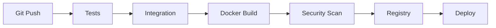

# 15 — Registries and CI/CD

## Registry Flow

```text
Developer
 ↓
Build
 ↓
Test
 ↓
Scan
 ↓
Registry
 ↓
Deploy
```

## Version Images

Prefer:

```text
automotive-etl:1.0.0
automotive-etl:1.1.0
```

rather than depending only on:

```text
latest
```

## Build Once, Promote

```text
Build
 ↓
Unit tests
 ↓
Integration tests
 ↓
Security scan
 ↓
Push
 ↓
Deploy same artifact
```

This reduces differences between environments.

## CI Pipeline



## Data Engineering CI

Include:

- Python tests
- SQL tests
- schema checks
- data quality tests
- migration tests
- integration tests
- Docker build
- image scan

## Rollback

```text
2.0.0
 ↓ failure
1.9.0
```

Versioned images make rollback easier.

## Registry Controls

Production registries may include:

- authentication
- authorization
- private repositories
- vulnerability scanning
- immutable artifacts
- retention policies
- audit logs

## Automobile Example

```text
vehicle-telemetry-etl:2026.09.03
```

can represent a tested deployment artifact.

## Principle

Treat the image as a versioned artifact, not as a manually modified server.
