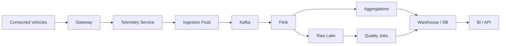

# Automobile Project Architecture

## Kubernetes responsibilities

### Deployment

Keeps ingestion replicas available.

### Service

Provides stable discovery.

### Job

Runs a one-time quality/backfill workload.

### CronJob

Runs scheduled aggregation.

### HPA

Can scale stateless ingestion according to metrics.

### RBAC

Controls API permissions.

### NetworkPolicy

Can restrict unnecessary communication.

## Non-Kubernetes responsibilities

Kafka provides event streaming.

Flink provides stream processing.

Object storage provides durable raw data.

The warehouse provides analytics.

Kubernetes coordinates the workloads; it does not replace those systems.
