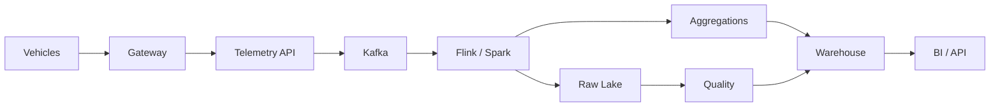

# Automobile CI/CD Architecture



CI/CD surrounds this platform:

```text
Git → CI → Registry → Kubernetes → Observability
```

Kubernetes manages workloads; Kafka, Flink/Spark and storage retain specialized responsibilities.
