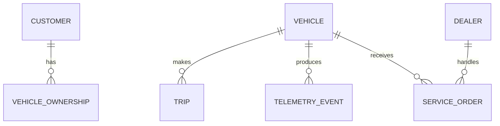

# Conceptual, Logical, and Physical Models

## Conceptual model

Shows major business objects.



It should be understandable to a business stakeholder.

## Logical model

Example:

```text
VEHICLE
vehicle_id       PK
vin              candidate key
model_id         FK
model_year
powertrain_type
```

Relationships and business rules are explicit, but the model does not need to commit to a specific
database syntax.

## Physical model

```sql
CREATE TABLE vehicle (
    vehicle_id BIGINT PRIMARY KEY,
    vin VARCHAR(17) NOT NULL UNIQUE,
    model_id BIGINT NOT NULL,
    model_year SMALLINT NOT NULL,
    powertrain_type VARCHAR(20) NOT NULL
);
```

Physical design decides data types, indexes, partitions, constraints, and platform-specific features.

## Why separate them?

A business relationship can remain stable while technology changes.

```text
Business:
Vehicle produces telemetry

Implementation A:
PostgreSQL telemetry table

Implementation B:
Kafka -> object storage -> lakehouse table
```

The physical implementation changed; the business concept did not.

## Review questions

- Are business terms unambiguous?
- Are identifiers stable?
- Is grain documented?
- Are relationships correct?
- Does the physical design match actual query patterns?
