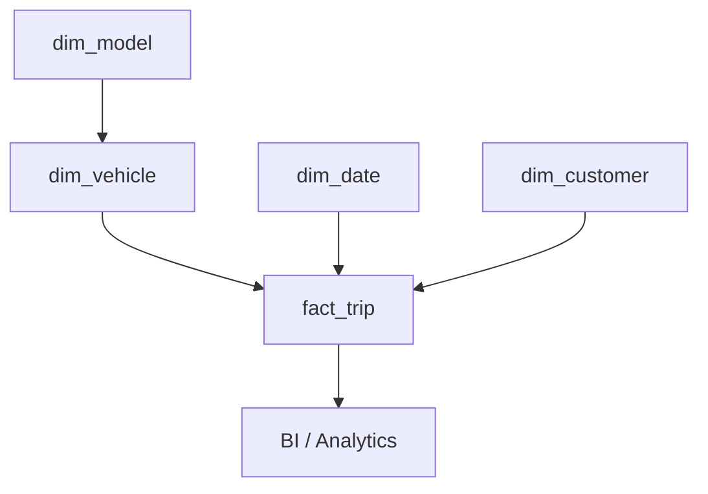

# Star Schema

A star schema has a central fact surrounded by descriptive dimensions.



Example:

```text
fact_trip
- trip_key
- date_key
- vehicle_key
- customer_key
- distance_km
- energy_kwh
- duration_minutes
```

## Benefits

- simple BI;
- fewer joins;
- intuitive structure;
- strong self-service experience.

## Costs

- dimension redundancy;
- larger dimensions;
- SCD complexity.

## Example query

```sql
SELECT
    v.powertrain_type,
    SUM(f.distance_km) AS distance_km,
    SUM(f.energy_kwh) AS energy_kwh
FROM fact_trip f
JOIN dim_vehicle v
  ON v.vehicle_key = f.vehicle_key
GROUP BY v.powertrain_type;
```

The star works because the fact grain is explicit.
