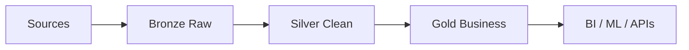

# Medallion Architecture

## Bronze

Keep:

- original payload;
- source ID;
- source timestamp;
- ingestion timestamp;
- schema version.

## Silver

Perform:

- casting;
- deduplication;
- canonical units;
- identifier reconciliation;
- validation.

## Gold

Perform:

- business aggregation;
- KPI logic;
- serving optimization.

## Late data

Silver should retain enough metadata to identify and reconcile late events.

Gold models should document whether old dates can change after late data arrives.
