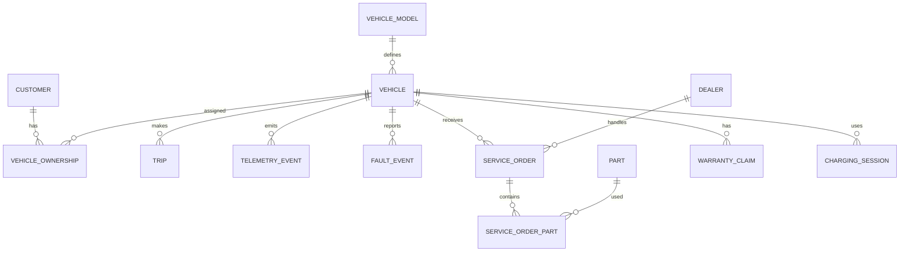

# Automobile Domain Model 🚗

The case study represents a connected-vehicle ecosystem.

## Entities

```text
Customer
Vehicle
Vehicle Model
Dealer
Trip
Telemetry Event
Fault Event
Service Order
Part
Warranty Claim
Charging Session
Manufacturing Event
```

## Relationships



## Design decisions

- Vehicle identity is separate from ownership history.
- Trip and telemetry are separate grains.
- Parts use an associative structure.
- Charging is its own business process.
- Faults are immutable events.
- Ownership can be historical.

## Questions for a production workshop

- Can one vehicle have multiple drivers?
- How are leased vehicles represented?
- What exactly starts/ends a trip?
- Are telemetry events raw or derived?
- How are VIN corrections handled?
