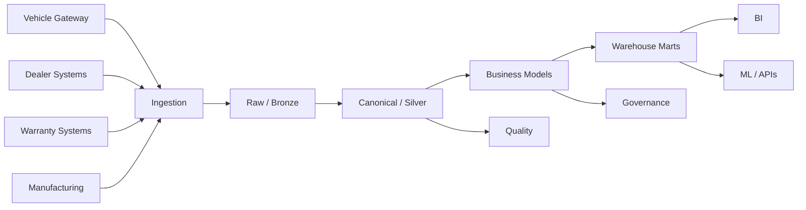

# Production Data Modeling Architecture

A mature automotive platform can separate ingestion, canonicalization, business modeling, and serving.

## Layer responsibilities

### Raw

Preserve source fidelity and ingestion metadata.

### Canonical

Standardize IDs, units, timestamps, and schema versions.

### Business

Apply enterprise definitions.

### Marts

Optimize for consumers.

## Every published model should have

- grain;
- owner;
- lineage;
- quality tests;
- freshness expectation;
- change policy;
- recovery procedure.
