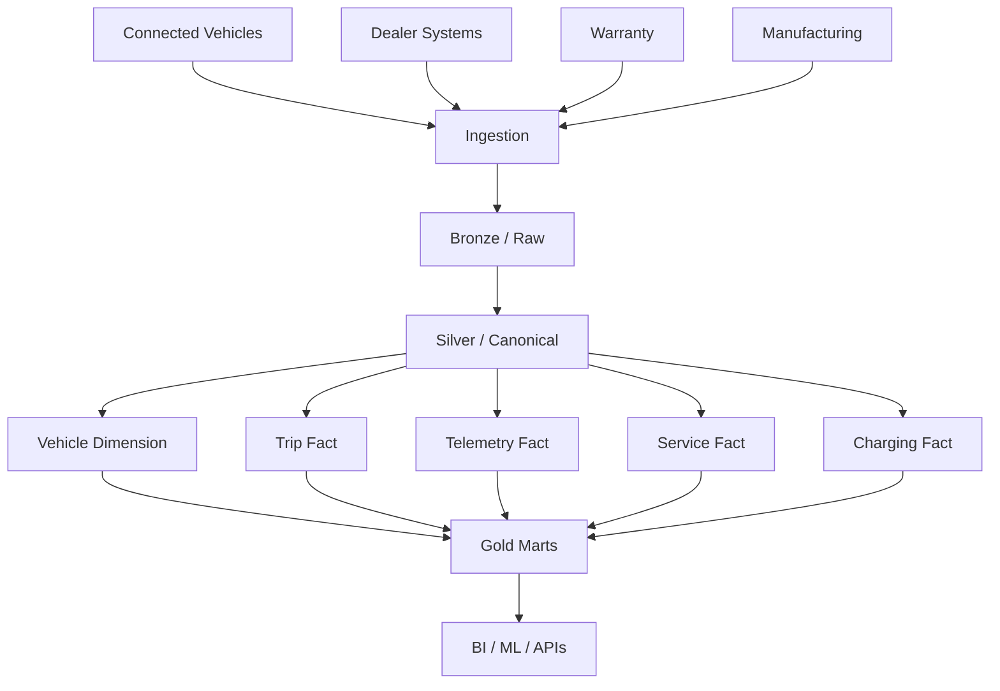

# End-to-End Automobile Model Architecture

## Design principles

- preserve raw data for replay;
- canonicalize units and identifiers;
- separate business-process grains;
- use conformed dimensions;
- test historical intervals;
- publish consumer-specific marts.
