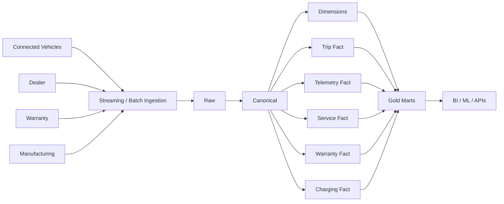

# Automobile Production Architecture

## Key decisions

- event time and ingestion time are both preserved;
- telemetry is immutable;
- vehicle is a conformed dimension;
- ownership/history is temporal;
- trips, service, and charging remain separate business processes;
- daily state is a snapshot;
- gold marts are consumer-oriented.
