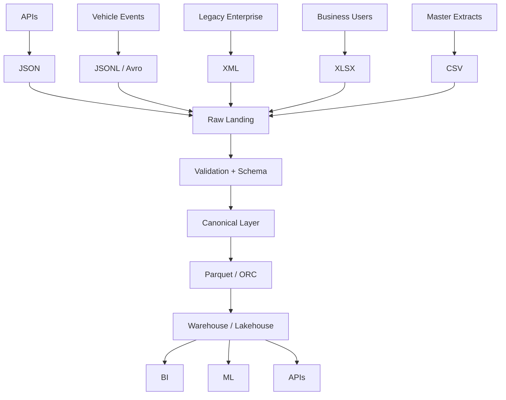

# Reference File-Format Architecture

```mermaid
flowchart TD
    A[APIs] --> B[JSON]
    C[Vehicle Events] --> D[JSONL / Avro]
    E[Legacy Enterprise] --> F[XML]
    G[Business Users] --> H[XLSX]
    I[Master Extracts] --> J[CSV]

    B --> K[Raw Landing]
    D --> K
    F --> K
    H --> K
    J --> K

    K --> L[Validation + Schema]
    L --> M[Canonical Layer]
    M --> N[Parquet / ORC]
    N --> O[Warehouse / Lakehouse]
    O --> P[BI]
    O --> Q[ML]
    O --> R[APIs]
```

## Key principle

Different boundaries can legitimately use different formats.

The source format should not dictate the final analytical format.
