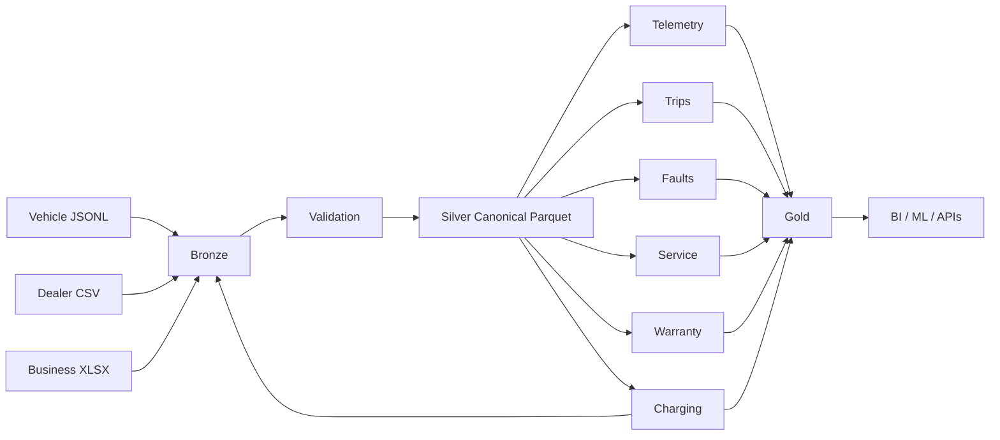

# Automobile File Formats Project 🚗

## Business problem

A connected-vehicle organization receives data from several systems.

```text
Vehicle Gateway -> JSONL
Dealer          -> CSV
Supplier        -> XML
Business team   -> XLSX
Streaming       -> Avro
```

The platform needs a reliable analytical representation.

## Target architecture



## Format decisions

### Bronze

Preserve source representation where replay/audit requirements justify it.

### Silver

Use a governed typed representation such as Parquet for analytical processing.

### Gold

Use optimized datasets/tables for business consumption.

## Quality rules

```text
event_id unique
vehicle_id required
battery_soc 0..100
speed_kph >= 0
odometer_km >= 0
event_time valid
schema_version recognized
```

## Portfolio requirement

Explain every format decision rather than merely listing file extensions.
