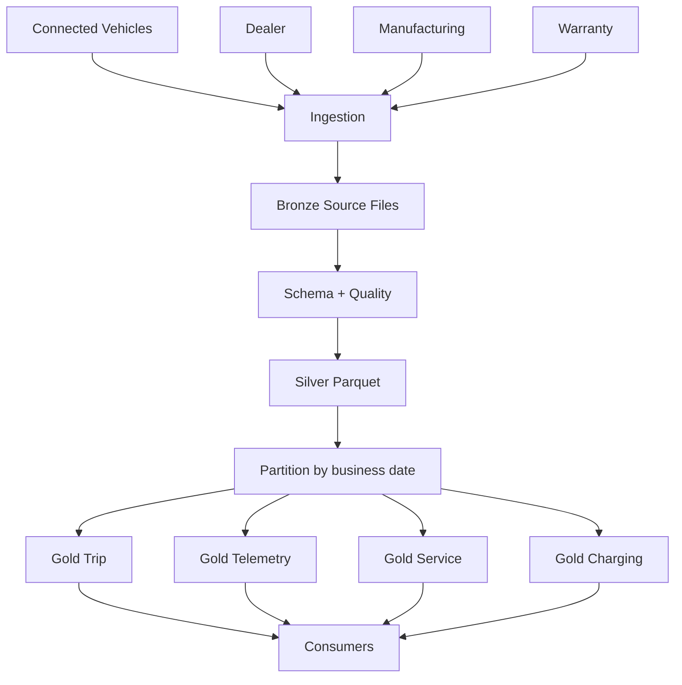

# Production Automobile File Architecture



## Operational controls

Monitor:

```text
files received
rows received
bad-record count
schema version
partition completeness
average file size
duplicate event rate
freshness
```

## Recovery

Keep enough source/canonical data to rebuild derived datasets after a bad deployment or corrupt
output.
