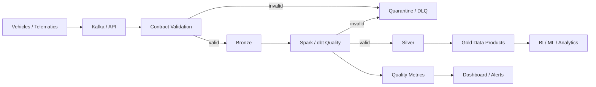

# Automobile Quality Architecture

```mermaid
flowchart LR
    A[Vehicles / Telematics] --> B[Kafka / API]
    B --> C[Contract Validation]
    C -->|valid| D[Bronze]
    C -->|invalid| Q[Quarantine / DLQ]
    D --> E[Spark / dbt Quality]
    E -->|valid| F[Silver]
    E -->|invalid| Q
    F --> G[Gold Data Products]
    G --> H[BI / ML / Analytics]
    E --> I[Quality Metrics]
    I --> J[Dashboard / Alerts]
```

Quality controls should be layered rather than concentrated in one final table test.
